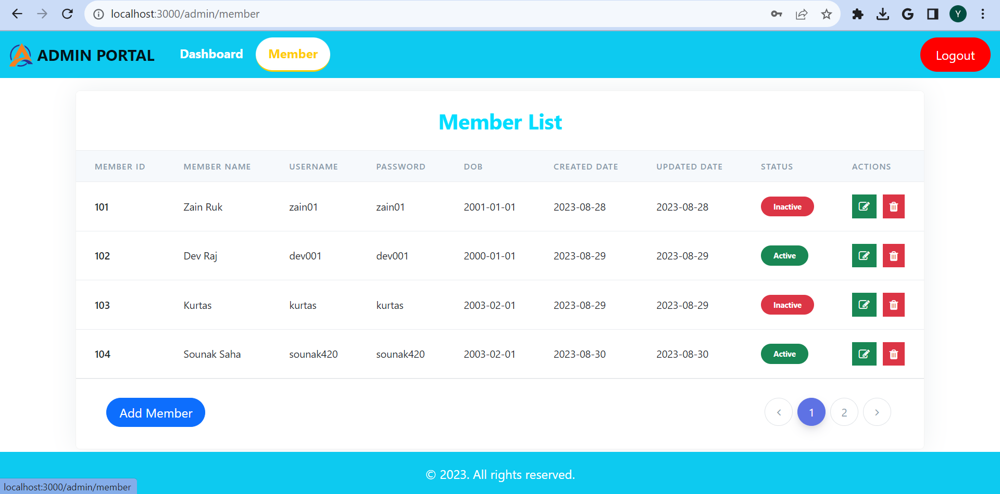

# Task Management System

A comprehensive task management system for efficient collaboration and productivity enhancement.

## Table of Contents

- [Overview](#overview)
- [Features](#features)
  - [Admin Portal](#admin-portal)
  - [Member Portal](#member-portal)
- [Screenshots](#screenshots)
- [Getting Started](#getting-started)
  - [Prerequisites](#prerequisites)
  - [Installation](#installation)
- [Usage](#usage)
- [Contributing](#contributing)
- [License](#license)

## Overview

The Task Management System is a meticulously crafted application tailored to streamline task assignment, submission, and tracking. It offers dedicated portals for both administrators and members, ensuring seamless collaboration and insightful task management.

## Features

### Admin Portal

- **Effortless Member Management:** Add, edit, and remove members with ease, ensuring optimal team organization.
- **Task Delegation:** Assign tasks to members, specifying due dates and priorities, for seamless task distribution.
- **Precise Evaluation:** Review task submissions, provide ratings, and offer detailed feedback for continuous improvement.
- **Comprehensive Dashboard:** Access a comprehensive admin dashboard for an overview of tasks, members, and performance metrics.

### Member Portal

- **Task Overview:** View assigned tasks with due dates, priorities, and clear instructions for focused execution.
- **Submission Excellence:** Submit task solutions, receive ratings, and access comprehensive feedback for growth-oriented learning.
- **Submission History:** Keep track of all submissions, enabling self-assessment and performance tracking.
- **Personal Dashboard:** Access a personalized dashboard displaying essential metrics, enabling better task management.

## Screenshots

  
  
  
  
  
  
  
  

## Getting Started

Follow these instructions to set up the project locally on your machine.

### Prerequisites

- Node.js (v14 or later)
- MongoDB (Ensure MongoDB is running)

### Frontend Installation

1. Navigate to the frontend directory: `cd task_management_system_frontend`
2. Install dependencies: `npm install`

### Backend Installation

1. Navigate to the backend directory: `cd task_management_system_backend`
2. Install dependencies: `npm install`
3. Set up environment variables in `.env`:
4. Run the backend server: `npm start`
5. Open another terminal window, navigate to the frontend directory, and run the frontend: `npm start`
6. Open your browser and navigate to [http://localhost:3000](http://localhost:3000) to access the application.

## Usage

- Sign in to the Admin Portal or Member Portal.
- Admins can manage members, assign tasks, and review submissions.
- Members can view tasks, submit solutions, and receive valuable feedback.
- Utilize personalized dashboards for insights and effective task tracking.

## Contributing

Contributions are warmly welcomed! To contribute, follow these steps:

1. Fork the repository.
2. Create a new branch for your feature: `git checkout -b feature-name`.
3. Make your changes and commit them: `git commit -m 'Add some feature'`.
4. Push your changes to the branch: `git push origin feature-name`.
5. Create a pull request.

## License

This project is licensed under the [MIT License](LICENSE).

## Connect with Me

Have questions or feedback? Feel free to connect with me on [LinkedIn](https://www.linkedin.com/in/your-username/).

## LinkedIn Post

I've also shared a video about this project on LinkedIn. Check it out: [LinkedIn Post with Video](https://www.linkedin.com/posts/your-username/your-post-link)
